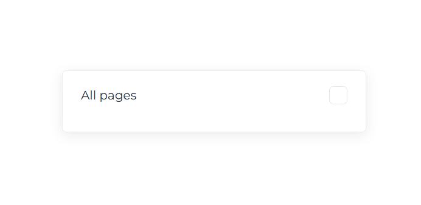
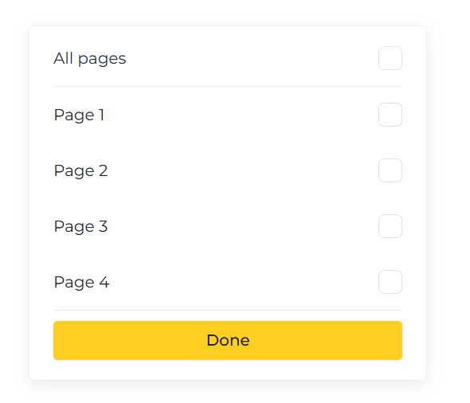
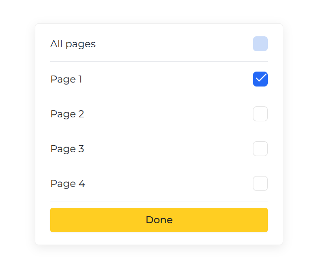
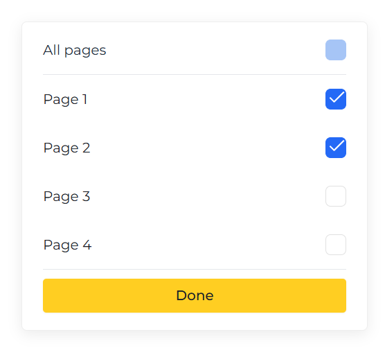
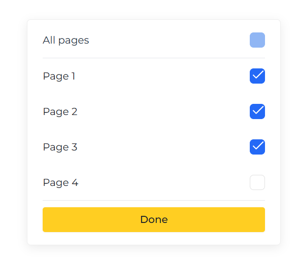
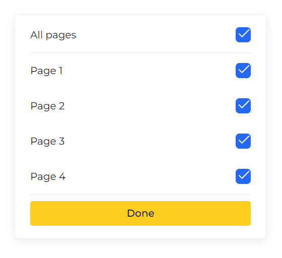
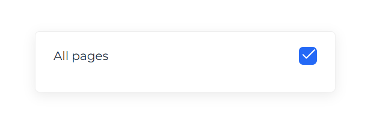

# 📋 Gradient Dropdown Menu Component

A beautiful and interactive multi-select dropdown menu with gradient checkbox system built with React. The checkbox color dynamically changes based on selection percentage, providing intuitive visual feedback.


## ✨ Features

- 🎨 **Gradient Color System** - Checkbox color transitions from gray to dark blue based on selection percentage
- ☑️ **Indeterminate State** - Shows a dash when some (but not all) items are selected
- 🎯 **Smart Selection** - Click "All pages" text to expand/collapse, click checkbox to select all
- 💫 **Smooth Animations** - Elegant transitions and hover effects
- 📱 **Responsive Design** - Centered layout that works on all screen sizes
- 🎭 **Custom Styling** - Pixel-perfect checkbox design matching Figma specifications

## 🎨 Color Progression

The checkbox color dynamically changes based on selection:

| Selection | Percentage | Color | Hex Code |
|-----------|------------|-------|----------|
| 0/4 pages | 0% | Gray | `#CDCDCD` |
| 1/4 pages | 25% | Light Blue | `#A8C5F5` |
| 2/4 pages | 50% | Medium Blue | `#6B9EF0` |
| 3/4 pages | 75% | Dark Blue | `#4685EC` |
| 4/4 pages | 100% | Darkest Blue | `#2469F6` |

## 🚀 Demo

[Live Demo](https://mohamedabdelwahaboka.github.io/gradient-dropdown-menu)

## 📦 Installation
```bash
# Clone the repository
git clone https://github.com/MohamedAbdElwahabOka/gradient-dropdown-menu.git

# Navigate to project directory
cd gradient-dropdown-menu

# Install dependencies
npm install

# Start development server
npm start
```

## 🛠️ Technologies Used

- **React** - JavaScript library for building user interfaces
- **React Hooks** - useState, useRef, useEffect for state management
- **CSS3** - Custom styling with pseudo-elements and transitions
- **Montserrat Font** - Modern and clean typography

## 📁 Project Structure
```
gradient-dropdown-menu/
├── src/
│   ├── DropdownMenu.jsx      # Main component
│   ├── DropdownMenu.css       # Styling
│   └── App.jsx                # Application entry
├── public/
├── package.json
└── README.md
```

## 💻 Usage
```jsx
import React from 'react';
import DropdownMenu from './DropdownMenu';

function App() {
  return (
    <div className="App">
      <DropdownMenu />
    </div>
  );
}

export default App;
```

## 🎯 Component API

### State Management
```javascript
const [open, setOpen] = useState(true);        // Dropdown open/closed state
const [selected, setSelected] = useState([]);  // Array of selected pages
```

### Key Functions

- `togglePage(page)` - Toggle individual page selection
- `handleSelectAll()` - Select or deselect all pages
- `getCheckboxColor()` - Calculate gradient color based on percentage

## 🎨 Customization

### Changing Colors

Edit the `getCheckboxColor()` function in `DropdownMenu.jsx`:
```javascript
const getCheckboxColor = () => {
  if (selected.length === 0) return "#CDCDCD";
  if (selected.length === 1) return "#A8C5F5";
  if (selected.length === 2) return "#6B9EF0";
  if (selected.length === 3) return "#4685EC";
  return "#2469F6";
};
```

### Changing Pages

Modify the `pages` array:
```javascript
const pages = ["Page 1", "Page 2", "Page 3", "Page 4"];
```

### Styling

Edit `DropdownMenu.css` to customize:
- **Checkbox size**: `.checkbox-item input[type="checkbox"]` → `width` & `height`
- **Border radius**: `border-radius` property
- **Button color**: `.done-btn` → `background-color`
- **Font**: Change `font-family` in the global styles

## 🔍 Code Highlights

### Custom Checkbox with Checkmark
```css
.checkbox-item input[type="checkbox"]:checked::before,
.checkbox-item input[type="checkbox"]:checked::after {
    content: '';
    position: absolute;
    background-color: #fff;
    border-radius: 2px;
}
```

### Indeterminate State Implementation
```javascript
useEffect(() => {
  if (selectAllRef.current) {
    selectAllRef.current.indeterminate = someSelected;
  }
}, [someSelected]);
```

### Dynamic Color System
```javascript
style={{
  backgroundColor: (allSelected || someSelected) ? getCheckboxColor() : 'transparent',
  borderColor: getCheckboxColor(),
  opacity: selected.length === 0 ? '0.6' : '1'
}}
```

## 📊 How It Works

1. **Initial State**: Dropdown starts open with no selections (gray checkbox)
2. **Partial Selection**: Select 1-3 pages → Indeterminate state with gradient color
3. **Full Selection**: Select all 4 pages → Checkmark appears with darkest blue
4. **Toggle Behavior**: Click "All pages" text to expand/collapse the menu
5. **Selection Control**: Click checkbox to select/deselect all items at once

## 🐛 Known Issues

- None at the moment! 🎉

## 🚀 Future Enhancements

- [ ] Add search functionality for filtering pages
- [ ] Implement keyboard navigation (Arrow keys, Enter, Escape)
- [ ] Add smooth animation when items expand/collapse
- [ ] Support for nested dropdowns
- [ ] Dark mode support
- [ ] TypeScript migration
- [ ] Accessibility improvements (ARIA labels)
- [ ] Export component as NPM package

## 📄 License

This project is licensed under the MIT License - see the [LICENSE](LICENSE) file for details.

## 👨‍💻 Author

**Mohamed Abd El Wahab**

- GitHub: [@MohamedAbdElwahabOka](https://github.com/MohamedAbdElwahabOka)
- LinkedIn: [Mohamed Abd El Wahab](https://www.linkedin.com/in/mohammed-oka/)
- Email: mohamedabdelwahabelazab@gmail.com

## 🙏 Acknowledgments

- Design inspiration from Figma community
- Color gradient system based on modern UI/UX principles
- Built with ❤️ using React and CSS3

## 📸 Screenshots

### Closed State

*Dropdown in closed state showing only "All pages"*

### Open State - No Selection (0%)

*Gray checkbox indicating no items selected*

### Partial Selection - 25%

*Light blue checkbox with dash (indeterminate state)*

### Partial Selection - 50%

*Medium blue checkbox showing half completion*

### Partial Selection - 75%

*Dark blue checkbox indicating nearly complete*

### Full Selection - 100%

*Darkest blue checkbox with checkmark - all items selected*

### Gradient Progression Overview

*Complete visual guide of color transitions*

## 🎓 Learning Resources

This project demonstrates:
- React Hooks (useState, useRef, useEffect)
- CSS Pseudo-elements (::before, ::after)
- Indeterminate checkbox state
- Dynamic inline styling
- Event handling and propagation
- Conditional rendering

## 💡 Tips for Contributors

1. **Code Style**: Follow the existing code style and formatting
2. **Comments**: Add comments for complex logic
3. **Testing**: Test all selection states before submitting PR
4. **Commits**: Use conventional commit messages (feat:, fix:, docs:)
5. **Issues**: Check existing issues before creating new ones

## 🤝 Contributing

Contributions, issues, and feature requests are welcome!

1. Fork the project
2. Create your feature branch (`git checkout -b feature/AmazingFeature`)
3. Commit your changes (`git commit -m 'feat: Add some AmazingFeature'`)
4. Push to the branch (`git push origin feature/AmazingFeature`)
5. Open a Pull Request

## 📞 Support

If you have any questions or need help, feel free to:
- Open an issue on GitHub
- Contact me via email
- Connect on LinkedIn

---

<div align="center">

⭐ **If you found this helpful, please give it a star!** ⭐

Made with 💙 by [Mohamed Abd El Wahab](https://github.com/MohamedAbdElwahabOka)

</div>
```

---

## إضافات مهمة:

1. **أنشئ مجلد screenshots** وأضف صور للمشروع:
```
screenshots/
├── closed.png
├── no-selection.png
├── 25-percent.png
├── 50-percent.png
├── 75-percent.png
├── full.png
└── gradient-overview.png
```

2. **أنشئ ملف LICENSE**:
```
MIT License

Copyright (c) 2024 Mohamed Abd El Wahab

Permission is hereby granted, free of charge, to any person obtaining a copy...
